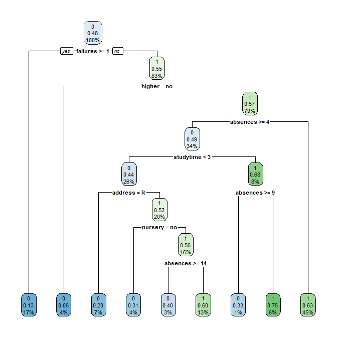

# Predicting Student Performance in a Portuguese Secondary Institution

## Completed: 04/15/2021


## Project Objective

Our objective is to use data collected regarding the conditions under which a student's performance was either "good" or "bad" as determined by the median grades of both math and language arts classes of a Portuguese secondary institution.

## Partners
* [Juliet Sieland-Harris]()
* [Dan Choi](https://github.com/dchoi-usd)

## Methods
* Data Exploration
* Pre-processing
* Data Visualization
* Statistical modeling
* Data modeling metrics

## Technologies
* R Programming (RStudio)
* Word
* Excel

## Presentations and Projects

* [Project Write-up]()
* [R Code](https://github.com/lshpaner/MSADS_502_Applied_Data_Mining_Student_Performance/blob/master/student_performance.md)

## Abstract

Qualitative and quantitative factors alike affect student grades.  We observed 1,044 students collectively from three terms of math and language arts classes of a Portuguese secondary institution to determine which of these factors is directly influenced by performance. Student grades were tallied over the three terms, from which performance was bisected by the median and binarized into two classes of 0 and 1 (“bad”, “good”, respectively). The dataset was further subjected to an 80:20 train-test split ratio to evaluate the model performance of data outside the training set visa vie implementation of six algorithms. The C5.0 and CART models produced accuracy scores of approximately 63%; whereas logistic regression and random forest models performed approximately 1% lower in terms of accuracy. Implementation of Naïve Bayes classification in conjunction with the neural network model, yielded more accurate results of 65% and 69%, respectively. We discuss other metrics like error rate and precision and note that each model, when cross-validated, has its own limitations that may inhibit or facilitate the prediction of student performance holistically. 




*Keywords*: student performance, machine learning, ensemble methods, data mining

## Code Sample

```{r}
#read in the students in the math class
student_math <- read.csv("student-mat.csv",sep=";",header=TRUE)
#read in the students in the Portuguese class
student_port <- read.csv("student-por.csv",sep=";",header=TRUE)

#Combine both files into one
student_file <- rbind(student_math, student_port)
dim(student_file)

#convert address into new column of binarized dummy variable
student_file$address_type <- ifelse(student_file$address=="U", 1, 0)
#convert family support into new column of binarized dummy variable
student_file$famsup_binary <- ifelse(student_file$famsup=="yes", 1, 0)

#Training Data
student_train$higher <- as.factor(student_train$higher)
student_train$address <- as.factor(student_train$address)
student_train$famsup <- as.factor(student_train$famsup)
student_train$performance <- as.factor(student_train$performance)
student_train$studytime <- as.numeric(student_train$studytime)
student_train$nursery <- as.factor(student_train$nursery)
student_train$failures <- as.numeric(student_train$failures)
student_train$absences <- as.numeric(student_train$absences)

#Test Data
student_test$higher <- as.factor(student_test$higher)
student_test$address <- as.factor(student_test$address)
student_test$famsup <- as.factor(student_test$famsup)
student_test$performance <- as.factor(student_test$performance)
student_test$studytime <- as.numeric(student_test$studytime)
student_test$nursery <- as.factor(student_test$nursery)
student_test$absences <- as.numeric(student_test$absences)
student_test$failures <- as.numeric(student_test$failures)

## C5.0 Model
library(C50); library(caret)
#Run training set through C5.0 to obtain Model 1, and assign to C5
C5 <- C5.0(formula <- performance ~ address + famsup + studytime + nursery +
           higher + failures + absences, data = student_train, control = 
           C5.0Control(minCases=50))
plot(C5, label="performance")

X = data.frame(performance = student_train$performance, 
                    address = student_train$address, 
                    famsup = student_train$famsup, 
                    studytime = student_train$studytime,
                    nursery = student_train$nursery,
                    higher = student_train$higher,
                    failures = student_train$failures,
                    absences = student_train$absences)

#Subset predictor variables from test data set into new df
test.X = data.frame(performance = student_test$performance, 
                    address = student_test$address, 
                    famsup = student_test$famsup, 
                    studytime = student_test$studytime,
                    nursery = student_test$nursery,
                    higher = student_test$higher,
                    failures = student_test$failures,
                    absences = student_test$absences)

#run test data through training data model
student_test$pred_c5 <- predict(object = C5, newdata = test.X)

t1_c5 <- table(student_test$performance, student_test$pred_c5)
t1_c5 <- addmargins(A = t1_c5, FUN = list(Total = sum), quiet =
TRUE); t1_c5

student_test[c('performance', 'pred_c5')] <- lapply(student_test[
  c('performance', 'pred_c5')], as.factor)
confusionMatrix(student_test$pred_c5, student_test$performance, positive='1')

accuracy_c5 = (t1_c5[1,1]+t1_c5[2,2])/t1_c5[3,3]
error_rate_c5 = (1-accuracy_c5)
sensitivity_c5 = t1_c5[2,2]/ t1_c5[2,3]
specificity_c5 = t1_c5[1,1]/t1_c5[1,3]
precision_c5 = t1_c5[2,2]/t1_c5[3,2]
F_1_c5 = 2*(precision_c5*sensitivity_c5)/(precision_c5+sensitivity_c5)
F_2_c5 = 5*(precision_c5*sensitivity_c5)/((4*precision_c5)+sensitivity_c5)
F_0.5_c5 = 1.25*(precision_c5*sensitivity_c5)/((0.25*precision_c5)+sensitivity_c5)


cat("\n Accuracy:",accuracy_c5, "\n Error Rate:",error_rate_c5,
    "\n Sensitivity:",sensitivity_c5,
"\n Specificity:",specificity_c5, "\n Precision:",precision_c5, "\n F1:",F_1_c5, 
"\n F2:",F_2_c5,
"\n F0.5:",F_0.5_c5)


```

## Model Evaluation Table:

| **Evaluation Measure**                                                  | **C5.0**  | **CART**  | **Logistic Regression** | **Random Forest** | **Naive Bayes** | **Neural Network** |
| ----------------------------------------------------------------------- | --------- | --------- | ----------------------- | ----------------- | --------------- | ------------------ |
| Accuracy                                                                | 0.6308411 | 0.635514  | 0.6253012               | 0.6261682         | 0.6495327       | 0.6879518          |
| Error rate                                                              | 0.3691589 | 0.364486  | 0.3746988               | 0.3738318         | 0.3504673       | 0.3120482          |
| Sensitivity                                                             | 0.59375   | 0.7708333 | 0.6055276               | 0.8020833         | 0.90625         | 0.8291457          |
| Specificity                                                             | 0.6610169 | 0.5254237 | 0.6435185               | 0.4830508         | 0.440678        | 0.5578704          |
| Precision                                                               | 0.5876289 | 0.5692308 | 0.6101266               | 0.557971          | 0.5686275       | 0.6333973          |
|                  | 0.5906736 | 0.6548673 | 0.6078184               | 0.6581197         | 0.6987952       | 0.7181719          |
|                  | 0.5925156 | 0.7198444 | 0.6064419               | 0.7375479         | 0.8100559       | 0.7808803          |
|  | 0.588843  | 0.6006494 | 0.6092012               | 0.5941358         | 0.6144068       | 0.6647865          |


