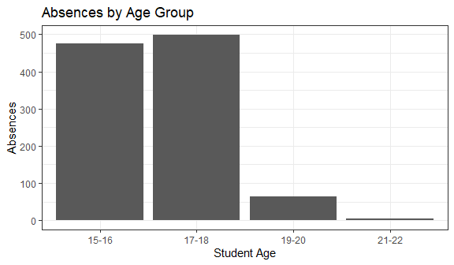
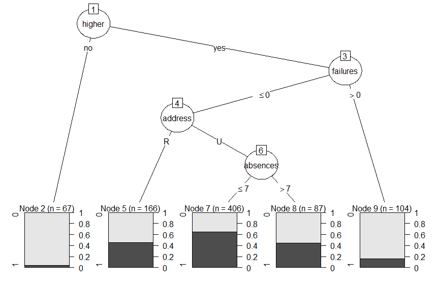
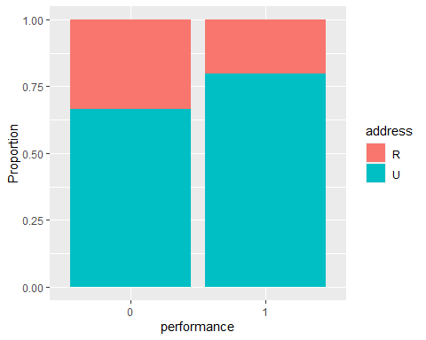

Predicting Student Performance in a Portuguese Secondary Institution
================
Leonid Shpaner, Juliet Sieland-Harris, and Dan Choi
April 15, 2021

``` r
#read in the students in the math class
student_math <- read.csv("student-mat.csv",sep=";",header=TRUE)
#read in the students in the Portuguese class
student_port <- read.csv("student-por.csv",sep=";",header=TRUE)

#Combine both files into one
student_file <- rbind(student_math, student_port)
dim(student_file)
```

    ## [1] 1044   33

``` r
write.csv(student_file, "student_file.csv") 
```

``` r
#inspect first few rows of merged data file
head(student_file,4)
```

    ##   school sex age address famsize Pstatus Medu Fedu    Mjob     Fjob reason
    ## 1     GP   F  18       U     GT3       A    4    4 at_home  teacher course
    ## 2     GP   F  17       U     GT3       T    1    1 at_home    other course
    ## 3     GP   F  15       U     LE3       T    1    1 at_home    other  other
    ## 4     GP   F  15       U     GT3       T    4    2  health services   home
    ##   guardian traveltime studytime failures schoolsup famsup paid activities
    ## 1   mother          2         2        0       yes     no   no         no
    ## 2   father          1         2        0        no    yes   no         no
    ## 3   mother          1         2        3       yes     no  yes         no
    ## 4   mother          1         3        0        no    yes  yes        yes
    ##   nursery higher internet romantic famrel freetime goout Dalc Walc health
    ## 1     yes    yes       no       no      4        3     4    1    1      3
    ## 2      no    yes      yes       no      5        3     3    1    1      3
    ## 3     yes    yes      yes       no      4        3     2    2    3      3
    ## 4     yes    yes      yes      yes      3        2     2    1    1      5
    ##   absences G1 G2 G3
    ## 1        6  5  6  6
    ## 2        4  5  5  6
    ## 3       10  7  8 10
    ## 4        2 15 14 15

``` r
sum(is.na(student_file))
```

    ## [1] 0

# Exploratory Data Analysis (EDA)

``` r
# sort by age and absence
by_age_absence = student_file[, c("age", "absences")]
head(by_age_absence[order(-by_age_absence$absences),],4)
```

    ##     age absences
    ## 277  18       75
    ## 184  17       56
    ## 75   16       54
    ## 316  19       40

We determine absences by age, since student performance is to some
degree based on absenteeism. The highest amount of absences occurs for
those at the age of 18 Our end goal is to predict student performance.

``` r
absence_outliers <- student_file[which(student_file$absences < -3 |   
                                    student_file$absences > 3), ]
dim(absence_outliers)
```

    ## [1] 480  33

``` r
absence_sort <- absence_outliers[order(-absence_outliers$absences), ]
absence_sort_outliers = absence_sort[, c("age", "absences")]
```

We are interested in data that is sensitive to outliers because we want
to build an inclusive model with an end goal of predicting the students’
performance for the entire population.

``` r
library(ggplot2); library(tidyverse)
```

    ## -- Attaching packages --------------------------------------- tidyverse 1.3.1 --

    ## v tibble  3.1.2     v dplyr   1.0.6
    ## v tidyr   1.1.3     v stringr 1.4.0
    ## v readr   1.4.0     v forcats 0.5.1
    ## v purrr   0.3.4

    ## -- Conflicts ------------------------------------------ tidyverse_conflicts() --
    ## x dplyr::filter() masks stats::filter()
    ## x dplyr::lag()    masks stats::lag()

``` r
ggplot(student_file, aes(age) ) + geom_histogram(binwidth = 1, color="white") +
  labs(x = "\nStudent Age", y = "Count \n") +
  ggtitle("Distribution (Histogram) of Students' Age") + theme_bw()
```


``` r
summary(student_file$age)
```

    ##    Min. 1st Qu.  Median    Mean 3rd Qu.    Max. 
    ##   15.00   16.00   17.00   16.73   18.00   22.00

``` r
student_file %>% count(sex) %>% ggplot(aes(x = reorder(sex, -n), y = n)) + 
  geom_bar(stat = 'identity') + labs(x = "Student Sex", y = "Count") + 
  ggtitle("Bar Graph of Students' Sex") + theme_bw()
```


``` r
student_file[student_file$age >= 15 & student_file$age <= 16, "age_group"] <- "15-16"
student_file[student_file$age >= 17 & student_file$age <= 18, "age_group"] <- "17-18"
student_file[student_file$age >= 19 & student_file$age <= 20, "age_group"] <- "19-20"
student_file[student_file$age >= 21 & student_file$age <= 22, "age_group"] <- "21-22"
ggplot(student_file) + geom_bar( aes(age_group))+ labs(x = "Student Age", 
y = "Absences") + ggtitle("Absences by Age Group") + theme_bw()
```



``` r
#Sum grades (G1, G2, and G3) into new column "Grades"
student_file$Grades <- rowSums(student_file[c("G1", "G2", "G3")])
#Binarize Grades into new variable called "performance"
student_file <- student_file %>% mutate(performance =
                                          ifelse(Grades > median(Grades), 1, 0))
student_file <- student_file %>% mutate(performance_binary =
                                          ifelse(Grades > median(Grades), "good", "bad"))
```

``` r
#convert address into new column of binarized dummy variable
student_file$address_type <- ifelse(student_file$address=="U", 1, 0)
#convert family support into new column of binarized dummy variable
student_file$famsup_binary <- ifelse(student_file$famsup=="yes", 1, 0)
```

``` r
#Bar Graph of Age with overlay of Higher Education response (higher = yes, no)

ggplot(student_file, aes(fct_infreq(age_group))) + 
  geom_bar(stat="count", aes(fill=performance_binary)) +
  labs(x = "Age Group", y = "Count") +
  ggtitle("Age Group by Performance: (Good or Bad)") + 
  theme_bw()
```


**Preliminary Findings Between Age, Sex, and Performance**

From the age group bar graph overlayed with “good” and “bad” performance
(grades), it is evident that the age group of 17-18 has a slightly
greater frequency of bad performance (260) than good (230). Ages 15-16
appear to have the best student performance among all groups.

While the strength of this graph is in its depiction of the overall
distribution (providing us with amounts of “good” and “bad” grades in
each respective age category), it does little to provide a comparison of
the number of “good” and “bad” grades by the age groups themselves.

Normalizing Age group by our target (performance) assuages this analysis
in such capacity. From here, we can conclude from our preliminary
findings that the younger the student, the better the overall grade
(greater than the median), with the highest amount (248) and frequency
of good grades for the 15-16 year age group.

``` r
#Normalized Bar Graph of Age Groups with overlay of response
ggplot(student_file, aes(age_group)) + geom_bar(aes(fill = performance_binary),
  position = "fill") + labs(x = "Age", y = "Count")+
  ggtitle("Age Group by Performance: (Good or Bad) - Normalized") + theme_bw()
```


``` r
#Bar Graph of Sex with overlay of Performance (good, bad)
ggplot(student_file, aes(fct_infreq(sex))) + geom_bar(stat="count", aes(fill=performance_binary)) +
  labs(x = "Sex", y = "Count")+
  ggtitle("Performance by Gender") + theme_bw()
```


``` r
#Normalized Bar Graph of Sex with overlay of Higher Education response
ggplot(student_file, aes(sex)) + 
  geom_bar(aes(fill = performance_binary),
position = "fill")+ labs(x = "Sex", y = "Count")+
ggtitle("Performance by Gender - Normalized") + theme_bw()
```


Moreover, it is important to note, that not only are there are more
females than males in the dataset, females also have a higher amount
(293) and frequency of good grades (performance) than their male
counterparts (201).

``` r
#Contingency Table - Response Type by Sex: by Columns
contingency_table <- table(student_file$performance_binary, student_file$sex)
contingency_table_col <- addmargins(A = contingency_table, FUN = list(total = sum),
                                  quiet = TRUE)
contingency_table_col
```

    ##        
    ##            F    M total
    ##   bad    298  252   550
    ##   good   293  201   494
    ##   total  591  453  1044

``` r
#Contingency Table - Age by Response Type: by Columns
contingency_table <- table(student_file$performance_binary, student_file$age_group)
contingency_table_col <- addmargins(A = contingency_table, FUN = list(total = sum),
                                  quiet = TRUE)
contingency_table_col
```

    ##        
    ##         15-16 17-18 19-20 21-22 total
    ##   bad     227   269    49     5   550
    ##   good    248   230    16     0   494
    ##   total   475   499    65     5  1044

# Train\_Test Split of the Data (“student\_file.csv”)

``` r
#Train_Test Split data into 80/20 

set.seed(7)
n <- dim(student_file)[1]; cat('\n Student File Dataset:', n)
```

    ## 
    ##  Student File Dataset: 1044

``` r
train_ind <- runif(n) < 0.80
student_train <- student_file[ train_ind, ]
student_test <- student_file[ !train_ind, ]

#check size dimensions of respective partions
n_train <- dim(student_train)[1]
cat('\n Student Train Dataset:', n_train)
```

    ## 
    ##  Student Train Dataset: 830

``` r
n_test <- dim(student_test)[1]
cat('\n Student Test Dataset:', n_test)
```

    ## 
    ##  Student Test Dataset: 214

``` r
table(student_train$performance_binary)
```

    ## 
    ##  bad good 
    ##  432  398

``` r
to.resample <- which(student_train$performance_binary == "good")

#figure out percentage of true values

percent_true = table(student_train$performance_binary)["good"]/
  dim(student_train)[1]*100
cat("\n", percent_true,"percent of the students have good performance.")
```

    ## 
    ##  47.95181 percent of the students have good performance.

``` r
#Bar Graph confirming Proportions

mydata <- c(n_train, n_test)

barplot(mydata, main="Bar Graph of Training Set vs. Test Set Proportion", 
        xlab="Set Type (Training vs. Test)", ylab = "Count", 
        names.arg=c("Training Set", "Test Set"), cex.names=0.9)
```


``` r
# Validate the partition by testing for the difference in mean age 
# for the training set versus the test set
mean_train = mean(student_train$age)
mean_test = mean(student_test$age)
difference_mean = mean_train - mean_test
cat("\n The difference between the mean of the test set vs. the train set is", 
    difference_mean)
```

    ## 
    ##  The difference between the mean of the test set vs. the train set is -0.1035919

``` r
# Validate the partition by testing for the difference in proportion of good 
# performance for the training set versus the test set.
prop_train_good = table(student_train$performance_binary)["good"] /
  dim(student_train)[1]
prop_test_good = table(student_test$performance_binary)["good"] / 
  dim(student_test)[1]
difference_proportion = prop_train_good - prop_test_good
cat("\n The difference between the proportions of the test set vs. the train set is", 
    difference_proportion)
```

    ## 
    ##  The difference between the proportions of the test set vs. the train set is 0.03091994

``` r
# Preparing (converting) variables to factor and numeric as necessary

#Training Data
student_train$higher <- as.factor(student_train$higher)
student_train$address <- as.factor(student_train$address)
student_train$famsup <- as.factor(student_train$famsup)
student_train$performance <- as.factor(student_train$performance)
student_train$studytime <- as.numeric(student_train$studytime)
student_train$nursery <- as.factor(student_train$nursery)
student_train$failures <- as.numeric(student_train$failures)
student_train$absences <- as.numeric(student_train$absences)

#Test Data
student_test$higher <- as.factor(student_test$higher)
student_test$address <- as.factor(student_test$address)
student_test$famsup <- as.factor(student_test$famsup)
student_test$performance <- as.factor(student_test$performance)
student_test$studytime <- as.numeric(student_test$studytime)
student_test$nursery <- as.factor(student_test$nursery)
student_test$absences <- as.numeric(student_test$absences)
student_test$failures <- as.numeric(student_test$failures)
```

# C5.0 Model

``` r
library(C50); library(caret)
```

    ## Loading required package: lattice

    ## 
    ## Attaching package: 'caret'

    ## The following object is masked from 'package:purrr':
    ## 
    ##     lift

``` r
#Run training set through C5.0 to obtain Model 1, and assign to C5
C5 <- C5.0(formula <- performance ~ address + famsup + studytime + nursery +
           higher + failures + absences, data = student_train, control = 
           C5.0Control(minCases=50))
plot(C5, label="performance")
```



``` r
X = data.frame(performance = student_train$performance, 
                    address = student_train$address, 
                    famsup = student_train$famsup, 
                    studytime = student_train$studytime,
                    nursery = student_train$nursery,
                    higher = student_train$higher,
                    failures = student_train$failures,
                    absences = student_train$absences)

#Subset predictor variables from test data set into new df
test.X = data.frame(performance = student_test$performance, 
                    address = student_test$address, 
                    famsup = student_test$famsup, 
                    studytime = student_test$studytime,
                    nursery = student_test$nursery,
                    higher = student_test$higher,
                    failures = student_test$failures,
                    absences = student_test$absences)

#run test data through training data model
student_test$pred_c5 <- predict(object = C5, newdata = test.X)
```

# C5.0 Model Evaluation

``` r
t1_c5 <- table(student_test$performance, student_test$pred_c5)
t1_c5 <- addmargins(A = t1_c5, FUN = list(Total = sum), quiet =
TRUE); t1_c5
```

    ##        
    ##           0   1 Total
    ##   0      78  40   118
    ##   1      39  57    96
    ##   Total 117  97   214

``` r
student_test[c('performance', 'pred_c5')] <- lapply(student_test[
  c('performance', 'pred_c5')], as.factor)
confusionMatrix(student_test$pred_c5, student_test$performance, positive='1')
```

    ## Confusion Matrix and Statistics
    ## 
    ##           Reference
    ## Prediction  0  1
    ##          0 78 39
    ##          1 40 57
    ##                                           
    ##                Accuracy : 0.6308          
    ##                  95% CI : (0.5624, 0.6956)
    ##     No Information Rate : 0.5514          
    ##     P-Value [Acc > NIR] : 0.01126         
    ##                                           
    ##                   Kappa : 0.2545          
    ##                                           
    ##  Mcnemar's Test P-Value : 1.00000         
    ##                                           
    ##             Sensitivity : 0.5938          
    ##             Specificity : 0.6610          
    ##          Pos Pred Value : 0.5876          
    ##          Neg Pred Value : 0.6667          
    ##              Prevalence : 0.4486          
    ##          Detection Rate : 0.2664          
    ##    Detection Prevalence : 0.4533          
    ##       Balanced Accuracy : 0.6274          
    ##                                           
    ##        'Positive' Class : 1               
    ## 

``` r
accuracy_c5 = (t1_c5[1,1]+t1_c5[2,2])/t1_c5[3,3]
error_rate_c5 = (1-accuracy_c5)
sensitivity_c5 = t1_c5[2,2]/ t1_c5[2,3]
specificity_c5 = t1_c5[1,1]/t1_c5[1,3]
precision_c5 = t1_c5[2,2]/t1_c5[3,2]
F_1_c5 = 2*(precision_c5*sensitivity_c5)/(precision_c5+sensitivity_c5)
F_2_c5 = 5*(precision_c5*sensitivity_c5)/((4*precision_c5)+sensitivity_c5)
F_0.5_c5 = 1.25*(precision_c5*sensitivity_c5)/((0.25*precision_c5)+sensitivity_c5)


cat("\n Accuracy:",accuracy_c5, "\n Error Rate:",error_rate_c5,
    "\n Sensitivity:",sensitivity_c5,
"\n Specificity:",specificity_c5, "\n Precision:",precision_c5, "\n F1:",F_1_c5, 
"\n F2:",F_2_c5,
"\n F0.5:",F_0.5_c5)
```

    ## 
    ##  Accuracy: 0.6308411 
    ##  Error Rate: 0.3691589 
    ##  Sensitivity: 0.59375 
    ##  Specificity: 0.6610169 
    ##  Precision: 0.5876289 
    ##  F1: 0.5906736 
    ##  F2: 0.5925156 
    ##  F0.5: 0.588843

# CART Model

``` r
library(rpart); library(rpart.plot)
cart_train <- rpart(formula = performance ~ address + famsup + 
                    studytime + nursery + higher + failures + absences, 
                    data = student_train, method = "class")

X_CART = data.frame(performance = student_test$performance, 
                    address = student_test$address, 
                    famsup = student_test$famsup, 
                    studytime = student_test$studytime,
                    nursery = student_test$nursery,
                    higher = student_test$higher,
                    failures = student_test$failures,
                    absences = student_test$absences)

rpart.plot(cart_train)
```


``` r
library(caret)
student_test$predCART <- predict(object = cart_train, newdata = X_CART, 
                                 type = "class")
head(student_test$predCART)
```

    ## [1] 1 1 0 1 1 1
    ## Levels: 0 1

``` r
table_CART <- table(student_test$performance, student_test$predCART)
table_CART <- addmargins(A=table_CART, FUN=list(Total=sum), quiet = TRUE);
table_CART
```

    ##        
    ##           0   1 Total
    ##   0      62  56   118
    ##   1      22  74    96
    ##   Total  84 130   214

``` r
student_test[c('performance', 'predCART')] <- 
  lapply(student_test[c('performance', 'predCART')], as.factor)
confusionMatrix(student_test$predCART, student_test$performance, positive='1')
```

    ## Confusion Matrix and Statistics
    ## 
    ##           Reference
    ## Prediction  0  1
    ##          0 62 22
    ##          1 56 74
    ##                                        
    ##                Accuracy : 0.6355       
    ##                  95% CI : (0.5672, 0.7)
    ##     No Information Rate : 0.5514       
    ##     P-Value [Acc > NIR] : 0.0077294    
    ##                                        
    ##                   Kappa : 0.2868       
    ##                                        
    ##  Mcnemar's Test P-Value : 0.0001866    
    ##                                        
    ##             Sensitivity : 0.7708       
    ##             Specificity : 0.5254       
    ##          Pos Pred Value : 0.5692       
    ##          Neg Pred Value : 0.7381       
    ##              Prevalence : 0.4486       
    ##          Detection Rate : 0.3458       
    ##    Detection Prevalence : 0.6075       
    ##       Balanced Accuracy : 0.6481       
    ##                                        
    ##        'Positive' Class : 1            
    ## 

``` r
accuracy_CART = (table_CART[1,1]+table_CART[2,2])/table_CART[3,3]
error_rate_CART = (1-accuracy_CART)
sensitivity_CART = table_CART[2,2]/ table_CART[2,3]
specificity_CART = table_CART[1,1]/table_CART[1,3]
precision_CART = table_CART[2,2]/table_CART[3,2]
F_1_CART = 2*(precision_CART*sensitivity_CART)/(precision_CART+sensitivity_CART)
F_2_CART = 5*(precision_CART*sensitivity_CART)/((4*precision_CART)+
                                                  sensitivity_CART)
F_0.5_CART = 1.25*(precision_CART*sensitivity_CART)/((0.25*precision_CART)+
                                                       sensitivity_CART)

cat("\n Accuracy:",accuracy_CART, "\n Error Rate:",error_rate_CART,
    "\n Sensitivity:",sensitivity_CART,
"\n Specificity:",specificity_CART, "\n Precision:",precision_CART, "\n F1:",
F_1_CART, 
"\n F2:",F_2_CART,
"\n F0.5:",F_0.5_CART)
```

    ## 
    ##  Accuracy: 0.635514 
    ##  Error Rate: 0.364486 
    ##  Sensitivity: 0.7708333 
    ##  Specificity: 0.5254237 
    ##  Precision: 0.5692308 
    ##  F1: 0.6548673 
    ##  F2: 0.7198444 
    ##  F0.5: 0.6006494

# Logistic Regression

``` r
logreg <- glm(formula = performance  ~ studytime + absences,
                data = student_train,
                family = binomial) 
options(scipen = 999)
summary(logreg)
```

    ## 
    ## Call:
    ## glm(formula = performance ~ studytime + absences, family = binomial, 
    ##     data = student_train)
    ## 
    ## Deviance Residuals: 
    ##     Min       1Q   Median       3Q      Max  
    ## -1.5625  -1.0839  -0.8063   1.1400   1.9740  
    ## 
    ## Coefficients:
    ##             Estimate Std. Error z value  Pr(>|z|)    
    ## (Intercept) -0.58902    0.19508  -3.019  0.002533 ** 
    ## studytime    0.36505    0.08545   4.272 0.0000194 ***
    ## absences    -0.05236    0.01439  -3.639  0.000273 ***
    ## ---
    ## Signif. codes:  0 '***' 0.001 '**' 0.01 '*' 0.05 '.' 0.1 ' ' 1
    ## 
    ## (Dispersion parameter for binomial family taken to be 1)
    ## 
    ##     Null deviance: 1149.2  on 829  degrees of freedom
    ## Residual deviance: 1111.6  on 827  degrees of freedom
    ## AIC: 1117.6
    ## 
    ## Number of Fisher Scoring iterations: 4

None of the variables should be removed from the model because there
exists statistical significance with the *p*−values associated with each
of the predictors.

$$\\hat{p}(y) = \\frac{\\text{exp}(b\_0+b\_1x\_1+b\_2x\_2+\\cdot\\cdot\\cdot+b\_px\_p)}{1+\\text{exp}(b\_0+b\_1x\_1+b\_2x\_2+\\cdot\\cdot\\cdot+b\_px\_p)}$$

$$\\hat{p}(\\textit{performance}) = \\frac{\\text{exp}(b\_0 + b\_1(\\textit{study time}) + b\_2(\\textit{absences}))}{1+\\text{exp}(b\_0 + b\_1(\\textit{study time})+b\_2(\\textit{absences}))}$$

Validating the model using the test dataset, we have the following:

``` r
logreg_test <- glm(formula = performance ~ studytime + absences, data = student_test, 
                      family = binomial)
options(scipen = 999)
summary(logreg_test)
```

    ## 
    ## Call:
    ## glm(formula = performance ~ studytime + absences, family = binomial, 
    ##     data = student_test)
    ## 
    ## Deviance Residuals: 
    ##     Min       1Q   Median       3Q      Max  
    ## -1.4589  -1.1062  -0.8896   1.2200   1.6604  
    ## 
    ## Coefficients:
    ##             Estimate Std. Error z value Pr(>|z|)  
    ## (Intercept) -0.95272    0.39953  -2.385   0.0171 *
    ## studytime    0.45467    0.18446   2.465   0.0137 *
    ## absences    -0.02810    0.02207  -1.273   0.2029  
    ## ---
    ## Signif. codes:  0 '***' 0.001 '**' 0.01 '*' 0.05 '.' 0.1 ' ' 1
    ## 
    ## (Dispersion parameter for binomial family taken to be 1)
    ## 
    ##     Null deviance: 294.4  on 213  degrees of freedom
    ## Residual deviance: 286.2  on 211  degrees of freedom
    ## AIC: 292.2
    ## 
    ## Number of Fisher Scoring iterations: 4

To obtain the predicted values of the response variable (higher) for
each record, we have the following:

``` r
#set.seed(7)
student_train$pred_probab <- predict(object = logreg, newdata = student_train, 
                                   type='response')
head(student_train$pred_probab)
```

    ## [1] 0.4829183 0.4055252 0.5990260 0.4829183 0.4055252 0.5352102

``` r
student_train$predict <- (student_train$pred_probab > 0.5)*1
head(student_train$predict)
```

    ## [1] 0 0 1 0 0 1

``` r
library(caret)
table_logreg <- table(student_train$performance, student_train$predict)
table_logreg <- addmargins(A=table_logreg, FUN=list(Total=sum), quiet = TRUE);
table_logreg
```

    ##        
    ##           0   1 Total
    ##   0     278 154   432
    ##   1     157 241   398
    ##   Total 435 395   830

``` r
student_train[c('performance', 'predict')] <- lapply(
  student_train[c('performance', 'predict')], as.factor)
confusionMatrix(student_train$predict, student_train$performance, positive='1')
```

    ## Confusion Matrix and Statistics
    ## 
    ##           Reference
    ## Prediction   0   1
    ##          0 278 157
    ##          1 154 241
    ##                                           
    ##                Accuracy : 0.6253          
    ##                  95% CI : (0.5914, 0.6583)
    ##     No Information Rate : 0.5205          
    ##     P-Value [Acc > NIR] : 0.0000000007302 
    ##                                           
    ##                   Kappa : 0.2491          
    ##                                           
    ##  Mcnemar's Test P-Value : 0.9097          
    ##                                           
    ##             Sensitivity : 0.6055          
    ##             Specificity : 0.6435          
    ##          Pos Pred Value : 0.6101          
    ##          Neg Pred Value : 0.6391          
    ##              Prevalence : 0.4795          
    ##          Detection Rate : 0.2904          
    ##    Detection Prevalence : 0.4759          
    ##       Balanced Accuracy : 0.6245          
    ##                                           
    ##        'Positive' Class : 1               
    ## 

``` r
accuracy_logreg = (table_logreg[1,1]+table_logreg[2,2])/table_logreg[3,3]
error_rate_logreg = (1-accuracy_logreg)
sensitivity_logreg = table_logreg[2,2]/ table_logreg[2,3]
specificity_logreg = table_logreg[1,1]/table_logreg[1,3]
precision_logreg = table_logreg[2,2]/table_logreg[3,2]
F_1_logreg = 2*(precision_logreg*sensitivity_logreg)/(precision_logreg
                                                      +sensitivity_logreg)
F_2_logreg = 5*(precision_logreg*sensitivity_logreg)/((4*precision_logreg)+
                                                  sensitivity_logreg)
F_0.5_logreg = 1.25*(precision_logreg*sensitivity_logreg)/
  ((0.25*precision_logreg)+sensitivity_logreg)

cat("\n Accuracy:",accuracy_logreg, "\n Error Rate:",error_rate_logreg,
    "\n Sensitivity:",sensitivity_logreg,
"\n Specificity:",specificity_logreg, "\n Precision:",precision_logreg,"\n F1:",
F_1_logreg, 
"\n F2:",F_2_logreg,
"\n F0.5:",F_0.5_logreg)
```

    ## 
    ##  Accuracy: 0.6253012 
    ##  Error Rate: 0.3746988 
    ##  Sensitivity: 0.6055276 
    ##  Specificity: 0.6435185 
    ##  Precision: 0.6101266 
    ##  F1: 0.6078184 
    ##  F2: 0.6064419 
    ##  F0.5: 0.6092012

# Random Forests

``` r
library(randomForest)
```

    ## randomForest 4.6-14

    ## Type rfNews() to see new features/changes/bug fixes.

    ## 
    ## Attaching package: 'randomForest'

    ## The following object is masked from 'package:dplyr':
    ## 
    ##     combine

    ## The following object is masked from 'package:ggplot2':
    ## 
    ##     margin

``` r
rf <- randomForest(formula = performance ~ address + famsup + studytime + 
                     nursery + higher + failures + absences, 
                     data = student_train, ntree=100, type = "classification")
#head(rf$predicted)

student_test$nursery = as.factor(student_test$nursery)

X_RF = data.frame(performance = student_test$performance, 
                    address = student_test$address, 
                    famsup = student_test$famsup, 
                    studytime = student_test$studytime,
                    nursery = student_test$nursery,
                    higher = student_test$higher,
                    failures = student_test$failures,
                    absences = student_test$absences)

student_test$predRF <- predict(object = rf, newdata = X_RF)
table_RF <- table(student_test$performance, student_test$predRF)
table_RF <- addmargins(A=table_RF, FUN=list(Total=sum), quiet = TRUE); table_RF
```

    ##        
    ##           0   1 Total
    ##   0      57  61   118
    ##   1      19  77    96
    ##   Total  76 138   214

``` r
student_test[c('performance', 'predRF')] <- lapply(student_test[c('performance', 
                                                   'predRF')], as.factor)
confusionMatrix(student_test$predRF, student_test$performance, positive='1')
```

    ## Confusion Matrix and Statistics
    ## 
    ##           Reference
    ## Prediction  0  1
    ##          0 57 19
    ##          1 61 77
    ##                                           
    ##                Accuracy : 0.6262          
    ##                  95% CI : (0.5576, 0.6912)
    ##     No Information Rate : 0.5514          
    ##     P-Value [Acc > NIR] : 0.0161          
    ##                                           
    ##                   Kappa : 0.274           
    ##                                           
    ##  Mcnemar's Test P-Value : 0.000004563     
    ##                                           
    ##             Sensitivity : 0.8021          
    ##             Specificity : 0.4831          
    ##          Pos Pred Value : 0.5580          
    ##          Neg Pred Value : 0.7500          
    ##              Prevalence : 0.4486          
    ##          Detection Rate : 0.3598          
    ##    Detection Prevalence : 0.6449          
    ##       Balanced Accuracy : 0.6426          
    ##                                           
    ##        'Positive' Class : 1               
    ## 

``` r
accuracy_RF = (table_RF[1,1]+table_RF[2,2])/table_RF[3,3]
error_rate_RF = (1-accuracy_RF)
sensitivity_RF = table_RF[2,2]/ table_RF[2,3]
specificity_RF = table_RF[1,1]/table_RF[1,3]
precision_RF = table_RF[2,2]/table_RF[3,2]
F_1_RF = 2*(precision_RF*sensitivity_RF)/(precision_RF+sensitivity_RF)
F_2_RF = 5*(precision_RF*sensitivity_RF)/((4*precision_RF)+sensitivity_RF)
F_0.5_RF = 1.25*(precision_RF*sensitivity_RF)/((0.25*precision_RF)+
                 sensitivity_RF)

cat("\n Accuracy:",accuracy_RF, "\n Error Rate:",error_rate_RF,
    "\n Sensitivity:",sensitivity_RF,
"\n Specificity:",specificity_RF, "\n Precision:",precision_RF, "\n F1:",F_1_RF, 
"\n F2:",F_2_RF,
"\n F0.5:",F_0.5_RF)
```

    ## 
    ##  Accuracy: 0.6261682 
    ##  Error Rate: 0.3738318 
    ##  Sensitivity: 0.8020833 
    ##  Specificity: 0.4830508 
    ##  Precision: 0.557971 
    ##  F1: 0.6581197 
    ##  F2: 0.7375479 
    ##  F0.5: 0.5941358

# Naive Bayes

Naive Bayes predicted performance based on address and higher:

``` r
library(e1071)
nb01<- naiveBayes(formula = performance ~ address + higher, data=student_train)
nb01
```

    ## 
    ## Naive Bayes Classifier for Discrete Predictors
    ## 
    ## Call:
    ## naiveBayes.default(x = X, y = Y, laplace = laplace)
    ## 
    ## A-priori probabilities:
    ## Y
    ##         0         1 
    ## 0.5204819 0.4795181 
    ## 
    ## Conditional probabilities:
    ##    address
    ## Y           R         U
    ##   0 0.3356481 0.6643519
    ##   1 0.2035176 0.7964824
    ## 
    ##    higher
    ## Y            no         yes
    ##   0 0.148148148 0.851851852
    ##   1 0.007537688 0.992462312

The predictions for this formula when evaluated with the test data set:

``` r
#Naive Bayes Model #1
student_test$nb01predict<- predict(object=nb01, newdata= student_test)
nb01.t <- table(student_test$performance, student_test$nb01predict)
rownames(nb01.t)<- c("Actual:0","Actual:1")
colnames(nb01.t)<- c("Predicted:0", "Predicted:1")
nb01.t <- addmargins(A=nb01.t, FUN=list(Total=sum), quiet=TRUE); nb01.t
```

    ##           
    ##            Predicted:0 Predicted:1 Total
    ##   Actual:0          45          73   118
    ##   Actual:1          24          72    96
    ##   Total             69         145   214

``` r
student_test[c('performance', 'nb01predict')] <- lapply(
  student_test[c('performance', 'nb01predict')], as.factor)
confusionMatrix(student_test$nb01predict, student_test$performance,positive='1')
```

    ## Confusion Matrix and Statistics
    ## 
    ##           Reference
    ## Prediction  0  1
    ##          0 45 24
    ##          1 73 72
    ##                                           
    ##                Accuracy : 0.5467          
    ##                  95% CI : (0.4774, 0.6147)
    ##     No Information Rate : 0.5514          
    ##     P-Value [Acc > NIR] : 0.5825          
    ##                                           
    ##                   Kappa : 0.1254          
    ##                                           
    ##  Mcnemar's Test P-Value : 0.000001095     
    ##                                           
    ##             Sensitivity : 0.7500          
    ##             Specificity : 0.3814          
    ##          Pos Pred Value : 0.4966          
    ##          Neg Pred Value : 0.6522          
    ##              Prevalence : 0.4486          
    ##          Detection Rate : 0.3364          
    ##    Detection Prevalence : 0.6776          
    ##       Balanced Accuracy : 0.5657          
    ##                                           
    ##        'Positive' Class : 1               
    ## 

``` r
accuracy_nb01 = (nb01.t[1,1]+nb01.t[2,2])/nb01.t[3,3]
error_rate_nb01 = (1-accuracy_nb01)
sensitivity_nb01 = nb01.t[2,2]/ nb01.t[2,3]
specificity_nb01 = nb01.t[1,1]/nb01.t[1,3]
precision_nb01 = nb01.t[2,2]/nb01.t[3,2]
F_1_nb01 = 2*(precision_nb01*sensitivity_nb01)/(precision_nb01+sensitivity_nb01)
F_2_nb01 = 5*(precision_nb01*sensitivity_nb01)/((4*precision_nb01)+
                                                  sensitivity_nb01)
F_0.5_nb01 = 1.25*(precision_nb01*sensitivity_nb01)/((0.25*precision_nb01)+
                                                       sensitivity_nb01)


cat("\n Accuracy:",accuracy_nb01, "\n Error Rate:",error_rate_nb01,
    "\n Sensitivity:",sensitivity_nb01,
"\n Specificity:",specificity_nb01, "\n Precision:",precision_nb01, "\n F1:",
F_1_nb01, 
"\n F2:",F_2_nb01,
"\n F0.5:",F_0.5_nb01)
```

    ## 
    ##  Accuracy: 0.546729 
    ##  Error Rate: 0.453271 
    ##  Sensitivity: 0.75 
    ##  Specificity: 0.3813559 
    ##  Precision: 0.4965517 
    ##  F1: 0.5975104 
    ##  F2: 0.6805293 
    ##  F0.5: 0.5325444

Naive Bayes predicted performance based on famsup and nursery:

``` r
#Naive Bayes Model #2
nb02<- naiveBayes( formula = performance ~ famsup + nursery, data=student_train)
nb02
```

    ## 
    ## Naive Bayes Classifier for Discrete Predictors
    ## 
    ## Call:
    ## naiveBayes.default(x = X, y = Y, laplace = laplace)
    ## 
    ## A-priori probabilities:
    ## Y
    ##         0         1 
    ## 0.5204819 0.4795181 
    ## 
    ## Conditional probabilities:
    ##    famsup
    ## Y          no       yes
    ##   0 0.4027778 0.5972222
    ##   1 0.3844221 0.6155779
    ## 
    ##    nursery
    ## Y          no       yes
    ##   0 0.2268519 0.7731481
    ##   1 0.1683417 0.8316583

The predictions for this formula when evaluated with the test data set:

``` r
student_test$nb02predict<- predict(object=nb02, newdata= student_test)
nb02.t <- table(student_test$performance,student_test$nb02predict)
rownames(nb02.t)<- c("Actual:0","Actual:1")
colnames(nb02.t)<- c("Predicted:0", "Predicted:1")
nb02.t <- addmargins(A=nb02.t, FUN=list(Total=sum), quiet=TRUE); nb02.t
```

    ##           
    ##            Predicted:0 Predicted:1 Total
    ##   Actual:0          55          63   118
    ##   Actual:1          49          47    96
    ##   Total            104         110   214

``` r
student_test[c('performance', 'nb02predict')] <- lapply(
  student_test[c('performance', 'nb02predict')], as.factor)
confusionMatrix(student_test$nb02predict, student_test$performance,positive='1')
```

    ## Confusion Matrix and Statistics
    ## 
    ##           Reference
    ## Prediction  0  1
    ##          0 55 49
    ##          1 63 47
    ##                                           
    ##                Accuracy : 0.4766          
    ##                  95% CI : (0.4081, 0.5458)
    ##     No Information Rate : 0.5514          
    ##     P-Value [Acc > NIR] : 0.9881          
    ##                                           
    ##                   Kappa : -0.0437         
    ##                                           
    ##  Mcnemar's Test P-Value : 0.2193          
    ##                                           
    ##             Sensitivity : 0.4896          
    ##             Specificity : 0.4661          
    ##          Pos Pred Value : 0.4273          
    ##          Neg Pred Value : 0.5288          
    ##              Prevalence : 0.4486          
    ##          Detection Rate : 0.2196          
    ##    Detection Prevalence : 0.5140          
    ##       Balanced Accuracy : 0.4778          
    ##                                           
    ##        'Positive' Class : 1               
    ## 

``` r
accuracy_nb02 = (nb02.t[1,1]+nb02.t[2,2])/nb02.t[3,3]
error_rate_nb02 = (1-accuracy_nb02)
sensitivity_nb02 = nb02.t[2,2]/ nb02.t[2,3]
specificity_nb02 = nb02.t[1,1]/nb02.t[1,3]
precision_nb02 = nb02.t[2,2]/nb02.t[3,2]
F_1_nb02 = 2*(precision_nb02*sensitivity_nb02)/(precision_nb02+sensitivity_nb02)
F_2_nb02 = 5*(precision_nb02*sensitivity_nb02)/((4*precision_nb02)+
                                                  sensitivity_nb02)
F_0.5_nb02 = 1.25*(precision_nb02*sensitivity_nb02)/((0.25*precision_nb02)+
                                                       sensitivity_nb02)

cat("\n Accuracy:",accuracy_nb02, "\n Error Rate:",error_rate_nb02,
    "\n Sensitivity:",sensitivity_nb02,
"\n Specificity:",specificity_nb02, "\n Precision:",precision_nb02, "\n F1:",
F_1_nb02, 
"\n F2:",F_2_nb02,
"\n F0.5:",F_0.5_nb02)
```

    ## 
    ##  Accuracy: 0.4766355 
    ##  Error Rate: 0.5233645 
    ##  Sensitivity: 0.4895833 
    ##  Specificity: 0.4661017 
    ##  Precision: 0.4272727 
    ##  F1: 0.4563107 
    ##  F2: 0.4757085 
    ##  F0.5: 0.4384328

``` r
#Naive Bayes Model #3
nb03<- naiveBayes(formula = performance ~ address + famsup, data=student_train)
nb03
```

    ## 
    ## Naive Bayes Classifier for Discrete Predictors
    ## 
    ## Call:
    ## naiveBayes.default(x = X, y = Y, laplace = laplace)
    ## 
    ## A-priori probabilities:
    ## Y
    ##         0         1 
    ## 0.5204819 0.4795181 
    ## 
    ## Conditional probabilities:
    ##    address
    ## Y           R         U
    ##   0 0.3356481 0.6643519
    ##   1 0.2035176 0.7964824
    ## 
    ##    famsup
    ## Y          no       yes
    ##   0 0.4027778 0.5972222
    ##   1 0.3844221 0.6155779

``` r
student_test$nb03predict<- predict(object=nb03, newdata= student_test)
nb03.t <- table(student_test$performance, student_test$nb03predict)
rownames(nb03.t)<- c("Actual:0","Actual:1")
colnames(nb03.t)<- c("Predicted:0", "Predicted:1")
nb03.t <- addmargins(A=nb03.t, FUN=list(Total=sum), quiet=TRUE)

student_test[c('performance', 'nb03predict')] <- lapply(
  student_test[c('performance', 'nb03predict')], as.factor)
confusionMatrix(student_test$nb03predict, student_test$performance,positive='1')
```

    ## Confusion Matrix and Statistics
    ## 
    ##           Reference
    ## Prediction  0  1
    ##          0 36 23
    ##          1 82 73
    ##                                           
    ##                Accuracy : 0.5093          
    ##                  95% CI : (0.4403, 0.5781)
    ##     No Information Rate : 0.5514          
    ##     P-Value [Acc > NIR] : 0.904           
    ##                                           
    ##                   Kappa : 0.062           
    ##                                           
    ##  Mcnemar's Test P-Value : 0.00000001512   
    ##                                           
    ##             Sensitivity : 0.7604          
    ##             Specificity : 0.3051          
    ##          Pos Pred Value : 0.4710          
    ##          Neg Pred Value : 0.6102          
    ##              Prevalence : 0.4486          
    ##          Detection Rate : 0.3411          
    ##    Detection Prevalence : 0.7243          
    ##       Balanced Accuracy : 0.5328          
    ##                                           
    ##        'Positive' Class : 1               
    ## 

``` r
accuracy_nb03 = (nb03.t[1,1]+nb03.t[2,2])/nb03.t[3,3]
error_rate_nb03 = (1-accuracy_nb03)
sensitivity_nb03 = nb03.t[2,2]/ nb03.t[2,3]
specificity_nb03 = nb03.t[1,1]/nb03.t[1,3]
precision_nb03 = nb03.t[2,2]/nb03.t[3,2]
F_1_nb03 = 2*(precision_nb03*sensitivity_nb03)/(precision_nb03+sensitivity_nb03)
F_2_nb03 = 5*(precision_nb03*sensitivity_nb03)/((4*precision_nb03)+
                                                  sensitivity_nb03)
F_0.5_nb03 = 1.25*(precision_nb03*sensitivity_nb03)/((0.25*precision_nb03)+
                                                       sensitivity_nb03)


cat("\n Accuracy:",accuracy_nb03, "\n Error Rate:",error_rate_nb03,
    "\n Sensitivity:",sensitivity_nb03,
"\n Specificity:",specificity_nb03, "\n Precision:",precision_nb03, "\n F1:",
F_1_nb03, 
"\n F2:",F_2_nb03,
"\n F0.5:",F_0.5_nb03)
```

    ## 
    ##  Accuracy: 0.5093458 
    ##  Error Rate: 0.4906542 
    ##  Sensitivity: 0.7604167 
    ##  Specificity: 0.3050847 
    ##  Precision: 0.4709677 
    ##  F1: 0.5816733 
    ##  F2: 0.67718 
    ##  F0.5: 0.5097765

``` r
#Naive Bayes Model #4
nb04<- naiveBayes(formula = performance ~ address + famsup + studytime + 
                    nursery + higher + failures + absences, data=student_train)
nb04
```

    ## 
    ## Naive Bayes Classifier for Discrete Predictors
    ## 
    ## Call:
    ## naiveBayes.default(x = X, y = Y, laplace = laplace)
    ## 
    ## A-priori probabilities:
    ## Y
    ##         0         1 
    ## 0.5204819 0.4795181 
    ## 
    ## Conditional probabilities:
    ##    address
    ## Y           R         U
    ##   0 0.3356481 0.6643519
    ##   1 0.2035176 0.7964824
    ## 
    ##    famsup
    ## Y          no       yes
    ##   0 0.4027778 0.5972222
    ##   1 0.3844221 0.6155779
    ## 
    ##    studytime
    ## Y       [,1]      [,2]
    ##   0 1.847222 0.8286022
    ##   1 2.123116 0.8472319
    ## 
    ##    nursery
    ## Y          no       yes
    ##   0 0.2268519 0.7731481
    ##   1 0.1683417 0.8316583
    ## 
    ##    higher
    ## Y            no         yes
    ##   0 0.148148148 0.851851852
    ##   1 0.007537688 0.992462312
    ## 
    ##    failures
    ## Y         [,1]      [,2]
    ##   0 0.43981481 0.8208919
    ##   1 0.05025126 0.2406696
    ## 
    ##    absences
    ## Y       [,1]     [,2]
    ##   0 5.111111 6.920273
    ##   1 3.396985 4.688610

``` r
student_test$nb04predict<- predict(object=nb04, newdata= student_test)
nb04.t <- table(student_test$performance, student_test$nb04predict)
rownames(nb04.t)<- c("Actual:0","Actual:1")
colnames(nb04.t)<- c("Predicted:0", "Predicted:1")
nb04.t <- addmargins(A=nb04.t, FUN=list(Total=sum), quiet=TRUE)

student_test[c('performance', 'nb04predict')] <- lapply(
  student_test[c('performance', 'nb04predict')], as.factor)
confusionMatrix(student_test$nb04predict, student_test$performance,positive='1')
```

    ## Confusion Matrix and Statistics
    ## 
    ##           Reference
    ## Prediction  0  1
    ##          0 52  9
    ##          1 66 87
    ##                                           
    ##                Accuracy : 0.6495          
    ##                  95% CI : (0.5815, 0.7133)
    ##     No Information Rate : 0.5514          
    ##     P-Value [Acc > NIR] : 0.002239        
    ##                                           
    ##                   Kappa : 0.3287          
    ##                                           
    ##  Mcnemar's Test P-Value : 0.0000000001004 
    ##                                           
    ##             Sensitivity : 0.9062          
    ##             Specificity : 0.4407          
    ##          Pos Pred Value : 0.5686          
    ##          Neg Pred Value : 0.8525          
    ##              Prevalence : 0.4486          
    ##          Detection Rate : 0.4065          
    ##    Detection Prevalence : 0.7150          
    ##       Balanced Accuracy : 0.6735          
    ##                                           
    ##        'Positive' Class : 1               
    ## 

``` r
accuracy_nb04 = (nb04.t[1,1]+nb04.t[2,2])/nb04.t[3,3]
error_rate_nb04 = (1-accuracy_nb04)
sensitivity_nb04 = nb04.t[2,2]/ nb04.t[2,3]
specificity_nb04 = nb04.t[1,1]/nb04.t[1,3]
precision_nb04 = nb04.t[2,2]/nb04.t[3,2]
F_1_nb04 = 2*(precision_nb04*sensitivity_nb04)/(precision_nb04+sensitivity_nb04)
F_2_nb04 = 5*(precision_nb04*sensitivity_nb04)/((4*precision_nb04)+
                                                  sensitivity_nb04)
F_0.5_nb04 = 1.25*(precision_nb04*sensitivity_nb04)/((0.25*precision_nb04)+
                                                       sensitivity_nb04)

cat("\n Accuracy:",accuracy_nb04, "\n Error Rate:",error_rate_nb04,
    "\n Sensitivity:",sensitivity_nb04,
"\n Specificity:",specificity_nb04, "\n Precision:",precision_nb04, "\n F1:",
F_1_nb04, 
"\n F2:",F_2_nb04,
"\n F0.5:",F_0.5_nb04)
```

    ## 
    ##  Accuracy: 0.6495327 
    ##  Error Rate: 0.3504673 
    ##  Sensitivity: 0.90625 
    ##  Specificity: 0.440678 
    ##  Precision: 0.5686275 
    ##  F1: 0.6987952 
    ##  F2: 0.8100559 
    ##  F0.5: 0.6144068

``` r
ggplot(student_train, aes(performance)) + 
  geom_bar(aes(fill=address),position="fill")+ylab("Proportion")
```



``` r
library(ggplot2);library(gridExtra)
```

    ## 
    ## Attaching package: 'gridExtra'

    ## The following object is masked from 'package:randomForest':
    ## 
    ##     combine

    ## The following object is masked from 'package:dplyr':
    ## 
    ##     combine

``` r
plotadd<- ggplot(student_train, aes(performance))+ 
  geom_bar(aes(fill=address),position="fill")+ylab("Proportion")
plothigh<- ggplot(student_train, aes(performance))+ 
  geom_bar(aes(fill=higher),position="fill")+ylab("Proportion")
grid.arrange(plotadd, plothigh,nrow=1)
```


# Neural Network

``` r
library(nnet)
library(NeuralNetTools)
neunet <- nnet(performance ~ address + famsup + studytime + 
               nursery + higher + failures + absences, 
               data = student_train, size = 1)
```

    ## # weights:  10
    ## initial  value 589.192090 
    ## iter  10 value 521.825217
    ## iter  20 value 495.452662
    ## iter  30 value 494.027863
    ## iter  40 value 489.580412
    ## iter  50 value 489.431383
    ## final  value 489.431321 
    ## converged

``` r
X_train <- subset(x=student_train, select =c("address", "famsup", 
                                             "studytime", "nursery", "higher", 
                                             "failures", "absences"))
student_train$pred_nnet <- predict(object = neunet, newdata =  X_train)

#head(student_train$pred_nnet)

student_train$predict_nnet <- (student_train$pred_nnet > 0.5)*1
#head(student_train$predict_nnet)
```

``` r
plotnet(neunet)
```


``` r
neunet$wts
```

    ##  [1] -19.4691154   1.4401849  -0.8018977   0.9469798   0.8391144  18.4772478
    ##  [7] -15.6204436  -0.1163643  -2.0201118   2.9029234

``` r
library(caret)
student_test$address <- as.factor(student_test$address)
student_test$famsup <- as.factor(student_test$famsup)
student_test$higher <- as.factor(student_test$higher)
student_test$freetime <- as.factor(student_test$freetime)
student_test$age <- as.numeric(student_test$age)

student_test$age.mm <- (student_test$age - min(student_test$age)) /
(max(student_test$age) - min(student_test$age))

X_test <- subset(x=student_test, select =c("address", "famsup", 
                                             "studytime", "nursery", "higher", 
                                             "failures", "absences"))

table_nnet <- table(student_train$performance, student_train$predict_nnet)
table_nnet <- addmargins(A=table_nnet, FUN=list(Total=sum), quiet = TRUE);
table_nnet
```

    ##        
    ##           0   1 Total
    ##   0     241 191   432
    ##   1      68 330   398
    ##   Total 309 521   830

``` r
student_train[c('performance', 'predict_nnet')] <- lapply(
  student_train[c('performance', 'predict_nnet')], as.factor)
confusionMatrix(student_train$predict_nnet, student_train$performance, 
                positive='1')
```

    ## Confusion Matrix and Statistics
    ## 
    ##           Reference
    ## Prediction   0   1
    ##          0 241  68
    ##          1 191 330
    ##                                                
    ##                Accuracy : 0.688                
    ##                  95% CI : (0.6552, 0.7194)     
    ##     No Information Rate : 0.5205               
    ##     P-Value [Acc > NIR] : < 0.00000000000000022
    ##                                                
    ##                   Kappa : 0.3824               
    ##                                                
    ##  Mcnemar's Test P-Value : 0.00000000000003437  
    ##                                                
    ##             Sensitivity : 0.8291               
    ##             Specificity : 0.5579               
    ##          Pos Pred Value : 0.6334               
    ##          Neg Pred Value : 0.7799               
    ##              Prevalence : 0.4795               
    ##          Detection Rate : 0.3976               
    ##    Detection Prevalence : 0.6277               
    ##       Balanced Accuracy : 0.6935               
    ##                                                
    ##        'Positive' Class : 1                    
    ## 

``` r
accuracy_nnet = (table_nnet[1,1]+table_nnet[2,2])/table_nnet[3,3]
error_rate_nnet = (1-accuracy_nnet)
sensitivity_nnet = table_nnet[2,2]/ table_nnet[2,3]
specificity_nnet = table_nnet[1,1]/table_nnet[1,3]
precision_nnet = table_nnet[2,2]/table_nnet[3,2]
F_1_nnet = 2*(precision_nnet*sensitivity_nnet)/(precision_nnet+sensitivity_nnet)
F_2_nnet = 5*(precision_nnet*sensitivity_nnet)/((4*precision_nnet)+
                                                  sensitivity_nnet)
F_0.5_nnet = 1.25*(precision_nnet*sensitivity_nnet)/((0.25*precision_nnet)+
                                                       sensitivity_nnet)

cat("\n Accuracy:",accuracy_nnet, "\n Error Rate:",error_rate_nnet,
    "\n Sensitivity:",sensitivity_nnet,
"\n Specificity:",specificity_nnet, "\n Precision:",precision_nnet, "\n F1:",
F_1_nnet, 
"\n F2:",F_2_nnet,
"\n F0.5:",F_0.5_nnet)
```

    ## 
    ##  Accuracy: 0.6879518 
    ##  Error Rate: 0.3120482 
    ##  Sensitivity: 0.8291457 
    ##  Specificity: 0.5578704 
    ##  Precision: 0.6333973 
    ##  F1: 0.7181719 
    ##  F2: 0.7808803 
    ##  F0.5: 0.6647865

``` r
library(ROCR)

# List of predictions
preds_list <- list(student_train$pred_probab, 
                   student_train$pred_nnet)

# List of actual values (same for all)
m <- length(preds_list)
actuals_list <- rep(list(student_train$performance), m)

# Plot the ROC curves
pred <- prediction(preds_list, actuals_list)
rocs <- performance(pred, "tpr", "fpr")
plot(rocs, col = as.list(1:m), main = "ROC Curves")
abline(0, 1, col='red', lty=2, lwd=4)
legend(x = "bottomright", 
       legend = c("Logistic Regression", "Neural Network"),
       fill = 1:m)
```


# Model Evaluation Formulas:

| **Evaluation Measure** | **Formula**                                                                  |     |
|------------------------|------------------------------------------------------------------------------|-----|
| Accuracy               | $\\frac{TN+TP}{GT}$                                                          |     |
|                        |                                                                              |     |
| Error rate             | 1 − *A**c**c**u**r**a**c**y*                                                 |     |
|                        |                                                                              |     |
| Sensitivity            | $\\frac{TP}{TAP}$                                                            |     |
|                        |                                                                              |     |
| Specificity            | $\\frac{TN}{TAN}$                                                            |     |
|                        |                                                                              |     |
| Precision              | $\\frac{TP}{TPP}$                                                            |     |
|                        |                                                                              |     |
| *F*<sub>1</sub>        | $2 \\cdot \\frac{precision \\cdot recall}{precision + recall}$               |     |
|                        |                                                                              |     |
| *F*<sub>2</sub>        | $5\\cdot\\frac{precision\\cdot recall}{(4 \\cdot precision) + recall}$       |     |
|                        |                                                                              |     |
| *F*<sub>0.5</sub>      | $1.25\\cdot\\frac{precision\\cdot recall}{(0.25 \\cdot precision) + recall}$ |     |

# Model Evaluation Table:

| **Evaluation Measure** | **C5.0**  | **CART**  | **Logistic Regression** | **Random Forest** | **Naive Bayes** | **Neural Network** |
|------------------------|-----------|-----------|-------------------------|-------------------|-----------------|--------------------|
| Accuracy               | 0.6308411 | 0.635514  | 0.6253012               | 0.6261682         | 0.6495327       | 0.6879518          |
| Error rate             | 0.3691589 | 0.364486  | 0.3746988               | 0.3738318         | 0.3504673       | 0.3120482          |
| Sensitivity            | 0.59375   | 0.7708333 | 0.6055276               | 0.8020833         | 0.90625         | 0.8291457          |
| Specificity            | 0.6610169 | 0.5254237 | 0.6435185               | 0.4830508         | 0.440678        | 0.5578704          |
| Precision              | 0.5876289 | 0.5692308 | 0.6101266               | 0.557971          | 0.5686275       | 0.6333973          |
| *F*<sub>1</sub>        | 0.5906736 | 0.6548673 | 0.6078184               | 0.6581197         | 0.6987952       | 0.7181719          |
| *F*<sub>2</sub>        | 0.5925156 | 0.7198444 | 0.6064419               | 0.7375479         | 0.8100559       | 0.7808803          |
| *F*<sub>0.5</sub>      | 0.588843  | 0.6006494 | 0.6092012               | 0.5941358         | 0.6144068       | 0.6647865          |
